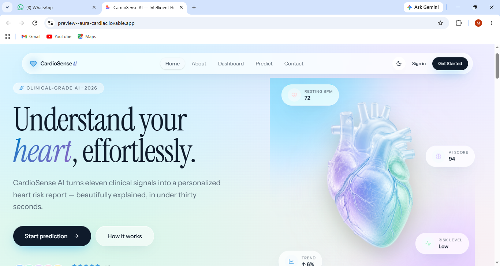
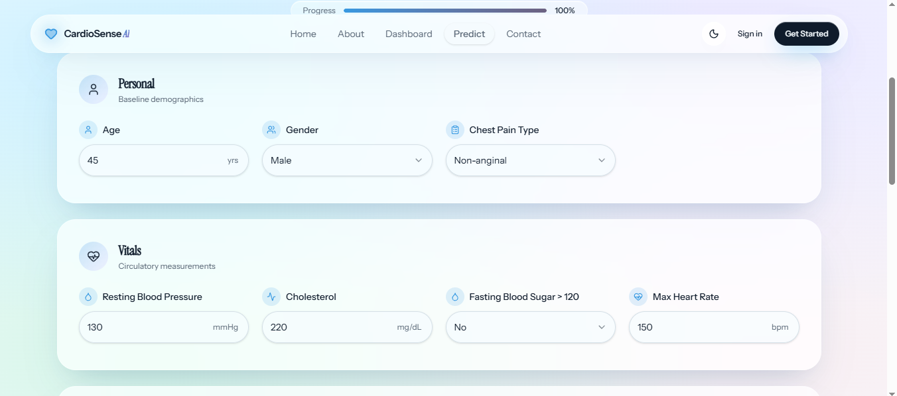
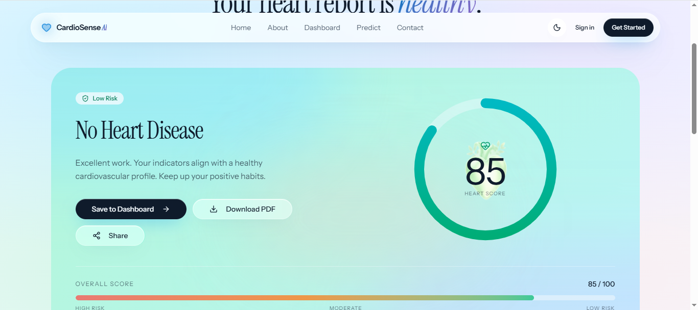
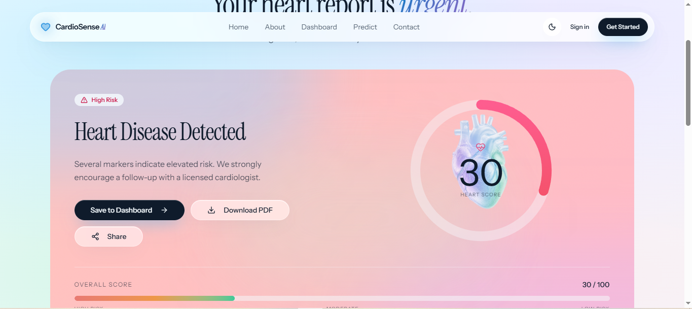
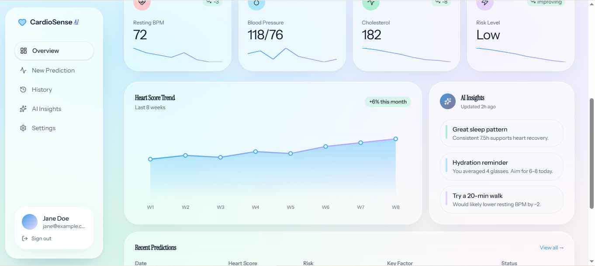

# CardioSense AI ❤️

An AI-powered heart disease risk prediction system that uses Machine Learning to analyze patient health parameters and provide an instant risk assessment.

## 🚀 Project Overview

CardioSense AI is a machine learning-based web application designed to predict the possibility of heart disease based on medical attributes such as age, blood pressure, cholesterol level, heart rate, ECG results, and other clinical factors.

The system provides a simple and user-friendly interface where users can enter health details and receive a risk prediction report.

## ✨ Features

- ❤️ Heart disease risk prediction using Machine Learning
- 🩺 User-friendly medical prediction form
- 📊 Instant health risk assessment
- 📄 Downloadable health report
- 📱 Responsive and modern interface
- ⚡ Real-time prediction through deployed API

## 🛠️ Technologies Used

### Frontend
- Lovable AI
- Modern web technologies

### Backend
- Python
- Flask
- REST API

### Machine Learning
- Scikit-learn
- Pandas
- NumPy
- Random Forest / ML classification model

### Deployment
- GitHub
- Render

## 📂 Project Structure
CardioSense-AI/ │ ├── app.py ├── train_model.py ├── heart_disease_model.pkl ├── requirements.txt ├── heart.csv └── README.md

## ⚙️ How to Run Locally

1. Clone the repository:
2. Install required libraries:
3. Run the Flask application:

4. Open the application and start predicting heart risk.

## 📸 Screenshots

### Home Page

### Prediction Form

### Healthy Prediction Result

### High Risk Prediction Result

### Dashboard

## 🎯 Future Improvements

- Add more medical datasets
- Improve prediction accuracy
- Add user authentication
- Store prediction history securely

## 👩‍💻 Author

Manshi Singh  
B.Tech Data Science

